# springboot058美发门店管理系统 / springboot-Hairdressing Store Management System


> 更多毕设项目可跳转至项目导航栏检索：[毕设项目](http://sysadmin.3vfree.vip)，需要联系博主v：xq-lucky311，q：1047944234. 备注：项目咨询注：由于前端项目太大，仅上传了后端代码，未包含前端代码...

## 项目简介  
基于 SpringBoot + MyBatis Plus + Shiro 的美发门店管理系统，采用 B/S 架构实现管理员与用户双角色管理，支持项目预定、产品库存管理、会员充值等核心业务功能。

## 特征介绍  
- **权限控制**：集成 Shiro 实现用户认证与权限管理，支持管理员/用户双角色操作隔离。  
- **高效开发**：MyBatis Plus 简化数据库操作，配合代码分层结构提升开发效率。  
- **工具集成**：整合 Hutool 工具库实现通用功能，Fastjson 处理 JSON 数据交换。  
- **文件管理**：独立文件上传模块支持静态资源管理，通过 FileUtil 实现资源高效存取。  
- **模块化设计**：清晰划分 Controller/Service/Dao/Entity 层级，VO/Model/View 多维度数据模型封装。  

## 代码结构 
```
src/
├── main/
│   ├── java/
│   │   ├── com/
│   │   │   ├── annotation/          # 权限注解
│   │   │   │   ├── IgnoreAuth.java
│   │   │   │   ├── LoginUser.java
│   │   │   ├── config/              # 全局配置
│   │   │   │   ├── InterceptorConfig.java
│   │   │   │   ├── MybatisPlusConfig.java
│   │   │   ├── controller/          # 接口层
│   │   │   │   ├── ChanpingoumaiController.java
│   │   │   │   ├── ChanpinkucunController.java
│   │   │   ├── dao/                 # 数据访问层
│   │   │   │   ├── ChanpingoumaiDao.java
│   │   │   │   ├── ChanpinkucunDao.java
│   │   │   ├── entity/              # 数据模型
│   │   │   │   ├── ChanpingoumaiEntity.java
│   │   │   │   ├── ChanpinkucunEntity.java
│   │   │   │   ├── model/           # 业务模型
│   │   │   │   │   ├── ChanpingoumaiModel.java
│   │   │   │   │   ├── ChanpinkucunModel.java
│   │   │   │   ├── view/            # 视图模型
│   │   │   │   │   ├── ChanpingoumaiView.java
│   │   │   │   │   ├── ChanpinkucunView.java
│   │   │   │   ├── vo/              # 值对象
│   │   │   │   │   ├── ChanpingoumaiVO.java
│   │   │   │   │   ├── ChanpinkucunVO.java
│   │   │   ├── interceptor/         # 请求拦截
│   │   │   │   ├── AuthorizationInterceptor.java
│   │   │   ├── service/             # 服务层
│   │   │   │   ├── ChanpingoumaiService.java
│   │   │   │   ├── ChanpinkucunService.java
│   │   │   │   ├── impl/            # 服务实现
│   │   │   │   │   ├── ChanpingoumaiServiceImpl.java
│   │   │   │   │   ├── ChanpinkucunServiceImpl.java
│   │   │   ├── utils/               # 工具类
│   │   │   │   ├── FileUtil.java
│   │   │   │   ├── MD5Util.java
│   │   ├── resources/
│   │   │   ├── mapper/              # MyBatis映射
│   │   │   │   ├── ChanpingoumaiDao.xml
│   │   │   │   ├── ChanpinkucunDao.xml
│   │   │   ├── application.yml      # 主配置
│   │   │   ├── static/              # 静态资源
│   │   │   │   ├── upload/          # 文件存储
```
## 使用说明
**后台地址**  
http://localhost:8080/springbootq9xc1/admin/dist/index.html  
管理员账号：abo / abo  

**前台地址**  
http://localhost:8080/springbootq9xc1/front/index.html  

**数据库配置**  
编辑 `src/main/resources/application.yml`：  
```yaml
url: jdbc:mysql://127.0.0.1:3306/springbootq9xc1?useUnicode=true&characterEncoding=utf-8
username: root
password: 123456  # 替换为实际密码
```

# 项目实际截图：
## 登录：


## 前台：

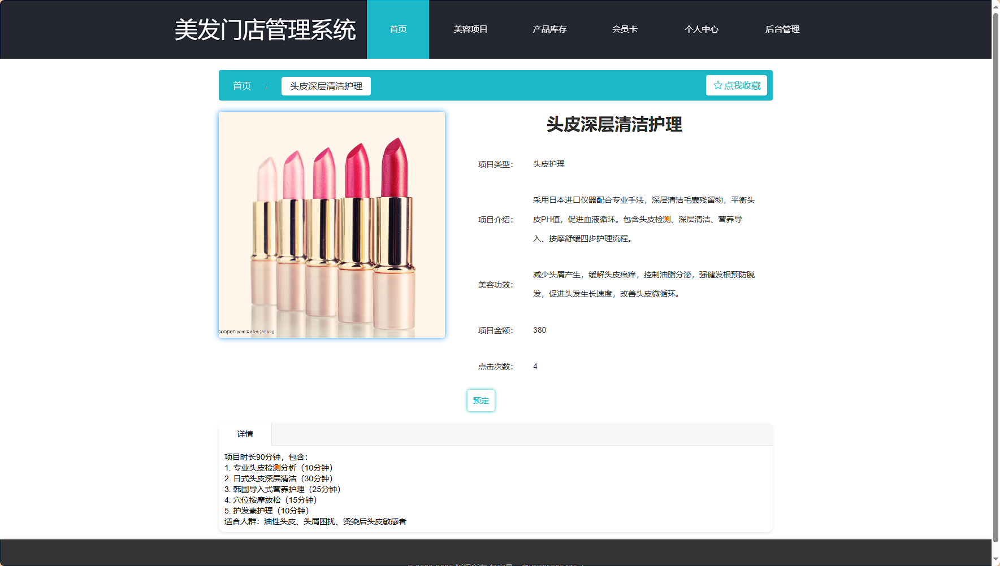
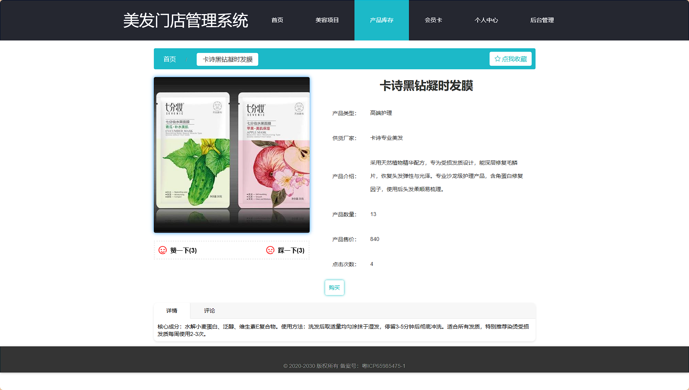

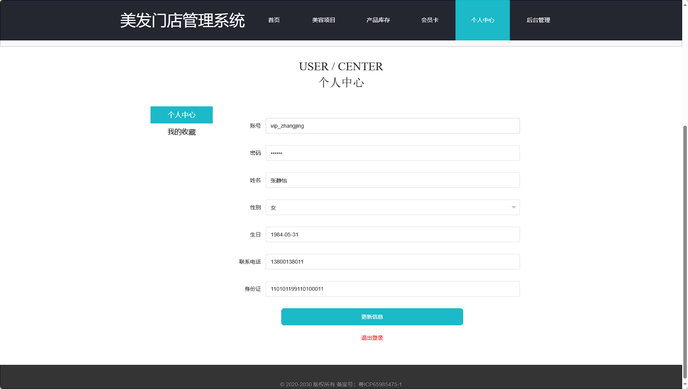

## 后台：
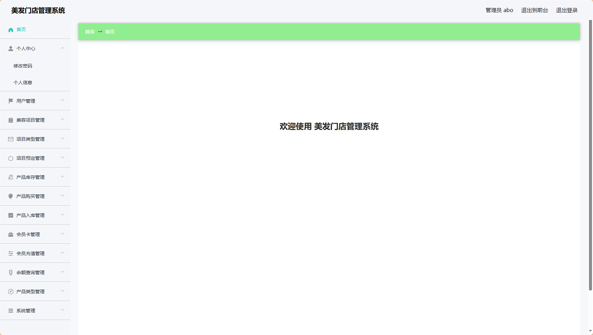
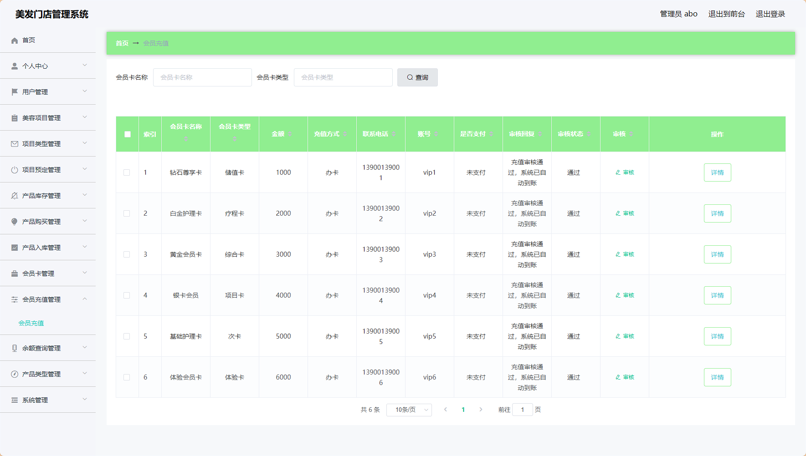
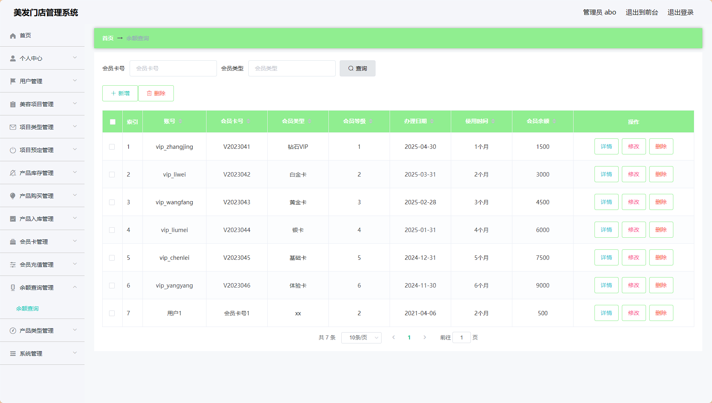
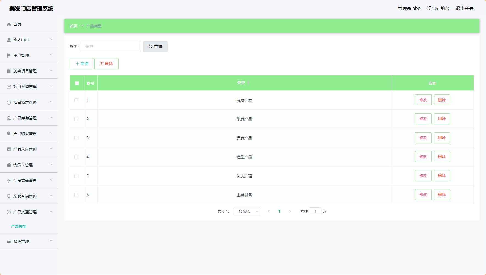
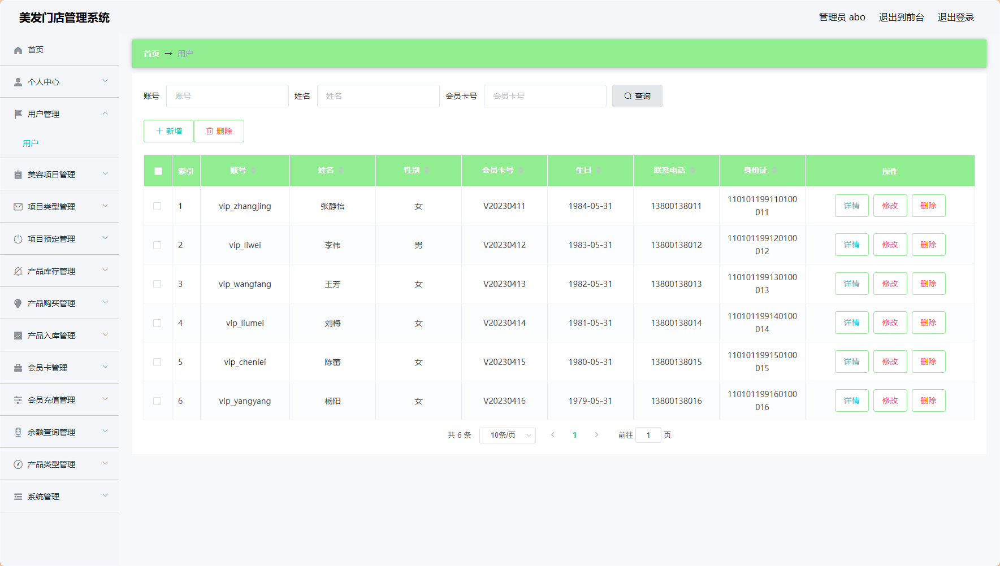
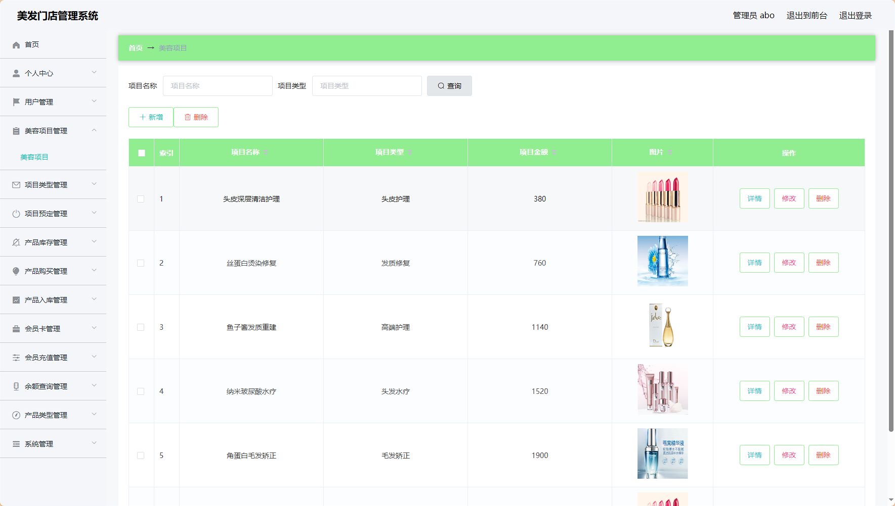
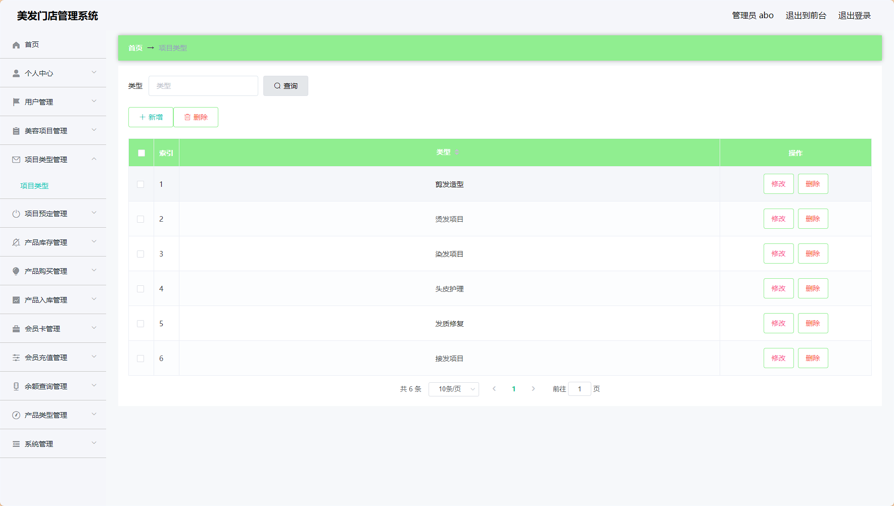
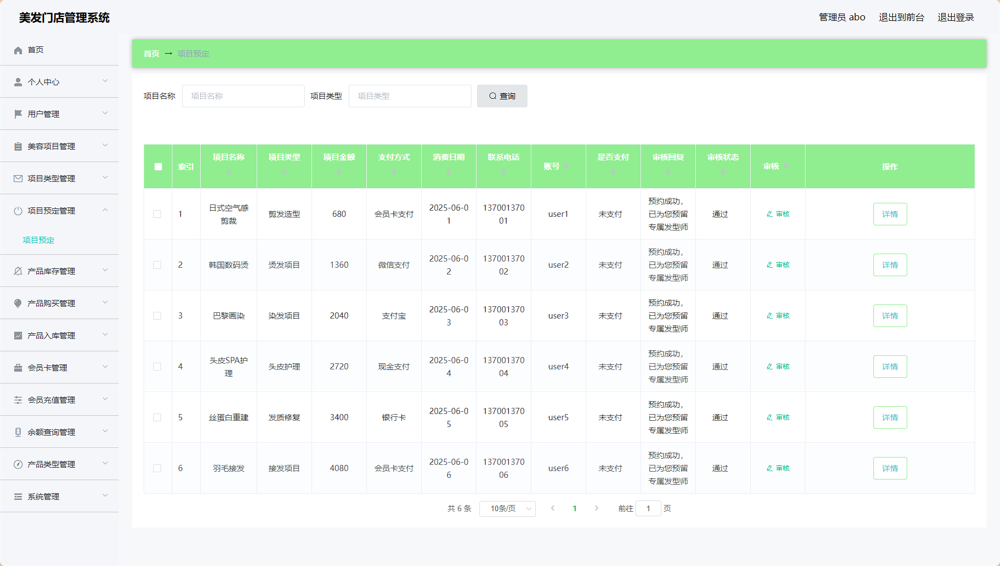
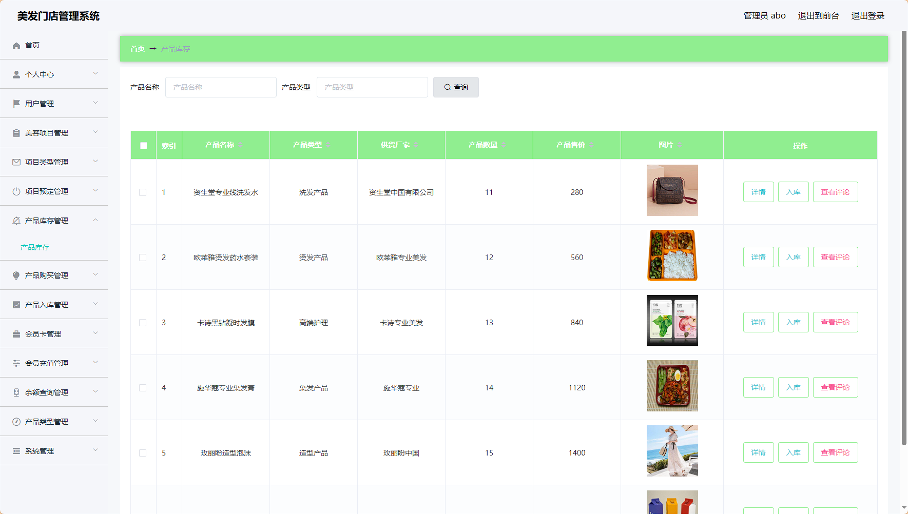
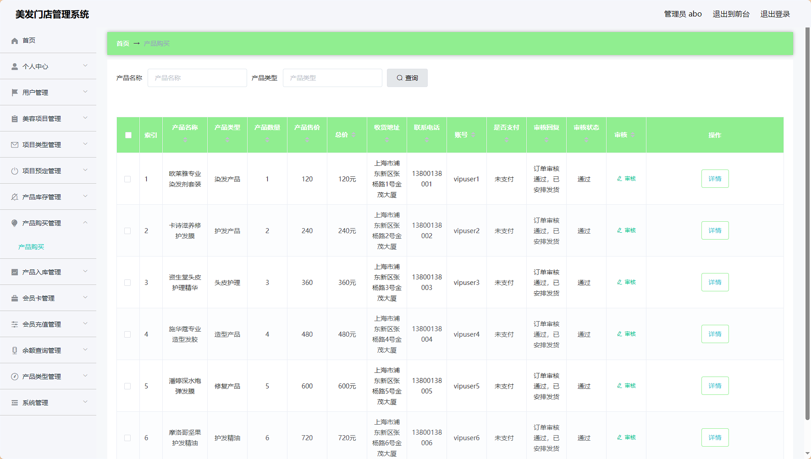
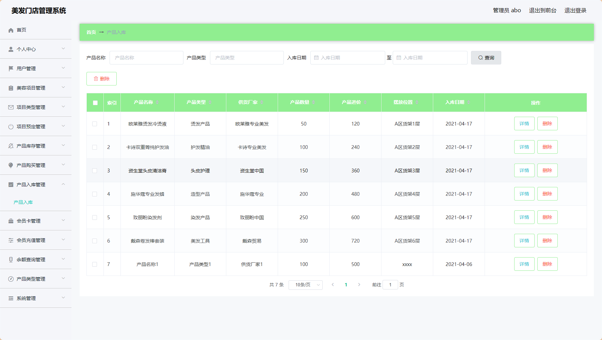
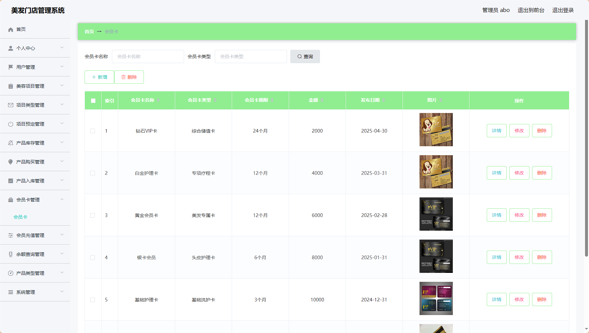

> 等等...

# 精选项目导航 & 快速部署工具
## 项目资源一站直达
- ​**访问项目导航站**：[点击进入](http://sysadmin.3vfree.vip)**快速检索所需项目名称**
- ​**技术栈全覆盖**：Java/SSm/Spring Boot/小程序等主流技术方案
- ​**配套资源**：每个项目均提供部署文档 + 演示视频（附效果截图）

### ▌导航站预览
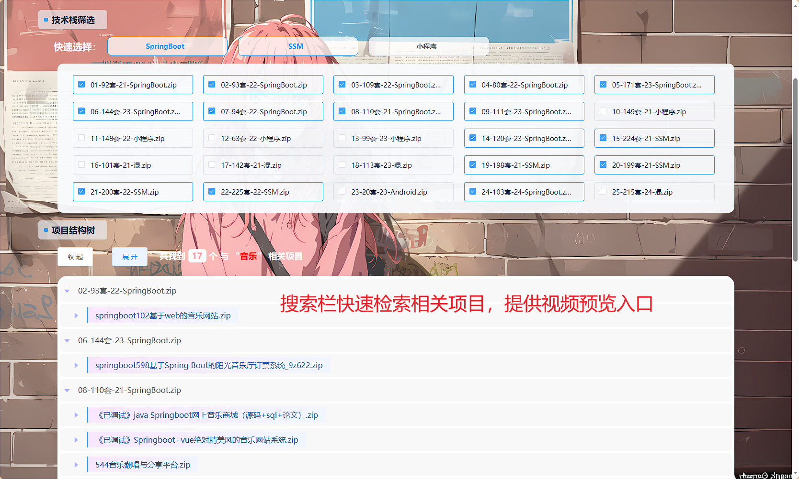

### ▌工具界面预览


## 捐赠
> 博主将持续更新Java全栈开发项目，包含ssm，springboot，前后端分离系统等项目。
> 此外如果您够宽裕，请博主喝杯咖啡吧！捐赠将用于服务器维护与开源社区建设，感谢您的认可！
> 如需更多Java相关项目毕设3000+，有其他项目需求，sql文件等可联系博主v:xq-lucky311

---